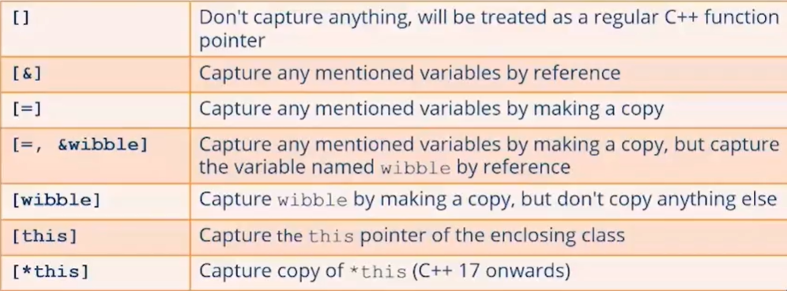

# Functional Progrramming — Lambda

A lambda is an anonymous function that allows you to define nested functions (closures).

Characteristics of lambdas:

- Similar to a reduced function syntax
- Can receive parameters
- Can return a value
- Can access variables defined in the outer scope

```cpp
// Define a lambda, using auto to hide function pointer syntax
auto func = [] () {
    std::cout << "Hello world" << std::endl;
}
```

- A lambda starts with `[]` which specify _variable capture_.
- Then we have `()` which is the argument list (you can omit the () if empty)
- The compiler deduces the return type (`void` here)

Here's a lambda that takes arguments:

```cpp
auto func = [] (const string & fn, const string & ln)
{
    std::cout << "Hello " << fn << " " << ln << std:: endl;
};

func("Simon", "Peter");
```

Here's a lambda that returns a value (the compiler deduces the return type as `double` here):

```cpp
auto func = [] (double netPrice)
{
    return netPrice * 1.20; // Apply sales tax at 20%.
};

std::cout << "Total Price: " << func(100.0) << std::endl;
```

You can explicitly specify the return type — usefull if you have multiple returns, or return literals.

```cpp
auto func = [] () -> std::string
{
    return "Hello"; // We want to return string explicitly, instead of const char* which deduces by the compiler automatically without any explicit return type
};
```

## Variable Capture

A lambda can access variables defined in the enclosing scope — called _variable capture_. If you want a lambda to have variable capture: Use syntax as `[&]`, rather than `[]`. It declares to the compiler that the lambda will capture external variables.

```cpp
void myFunc() {
    std::string prefix;
    std::cin >> prefix;

    auto displayMessage = [&] (const std::string & message)
    {
        std:: cout << prefix << " " << meesage << std::endl;
    };

    displayMessage("Nice day!");
}
```

### How variable Capture works?

- Internally, the compiler converts a lambda into a class, The class overloads `operator()`, so it acts like a function
- A lambda is an instance of this class
  - When the object is constructed
  - Any variables in the surrounding environment are passed into the constructor of the lambda class
  - Are saved as member variables

### Options of Specifying Variable Capture



### Capturing `this` vs capturing `*this`

```cpp
struct Widget {
    int x = 10, y = 20;

    auto m1() {
        auto lambda = [this] { // Captures this pointer
            std::cout << x << " " << y << std::endl;
        };
        return lambda;
    }

    auto m2() {

        auto lambda = [*this] { // Captures const copy of *this
            std::cout << x << " " << y << std::endl;
        };
        return lambda;
    }
}
```

#### Usage of `this`

```cpp
Widget w1;
auto l1 = w1.m1(); // Captures a pointer to the object, creates an object and return it (returns a lambda object)

l1(); // It will be accessing effectively X and Y. It captured a pointer to the Widget object
```

⚠ If the Widget object had been destroyed between the point when you create the lambda and the point when you use the lambda and if this widget object had gone out of scope, there is a problem here, because the `this` pointer would then be pointing to an object that is no longer in existence. It is dangerous especially in Multithreading used project.

#### Usage of `*this` (C++17)

```cpp
Widget w2;
auto l2 = w2.m2(); // Captures const copy of *this (Copy of the contents)

l2(); // Safer, less efficient, captures a copy
```

### Lambdas and the STL

One of the biggest advantages of lambdas is that they can simplify how you use the STL. For example, compare the following snippets:

```cpp
std::vector<int> v {100, 200, 300};

for (auto iter = v.begin(), end = v.end(); iter != end; iter++)
{
    std::cout << *iter << std::endl;
}
```

```cpp
std::vector<int> v {100, 200, 300};

std::for_each (v.begin(), v.end(), [] (int val) {
    std::cout << val << std::endl;
});
```

## The Type of a Lambda

How can you define a function that takes a mabdas as a parameter? What generalized type can you use to represent a lambda?

- Lambdas are looks like a **function** but they are actually a `class`. Compiler generates a class at compile time based on parameters that you captured, and that class has name that only the compiler knows.
- C++ has a convenient wrapper for storing any kind of function (lambda, function pointer, function object): `std::function`. It represents callable object. When you create a `std::function` varaible, you say effectively "what type of parameters am I expecting the function to take?".

```cpp
class AddressBook {
    private:
        std::vector<string> friends;

    public:
        std::vector<string> find (std::function<bool (const string &)> myFunc)
        {
            std::vector<string> vec;

            for (auto i = friends.begin(), end=friends.end(); i != end; ++i)
            {
                if (myFunc(*i))
                {
                    vec.push_back(*i);
                }
            }
            return vec;
        }
};
```

```cpp
AddressBook book;
...

auto v = book.find([](const string& s) {
    return s.length() == 7;
});

std::for_each(v.begin(), v.end(), [] (const string& s) { std::cout << s << "\n"; });
```

`(std::function<bool (const string &)> f)` gets the `(const string &)` parameter and returns boolean (`bool`). `std::function` can get both functions and lambda objects.
